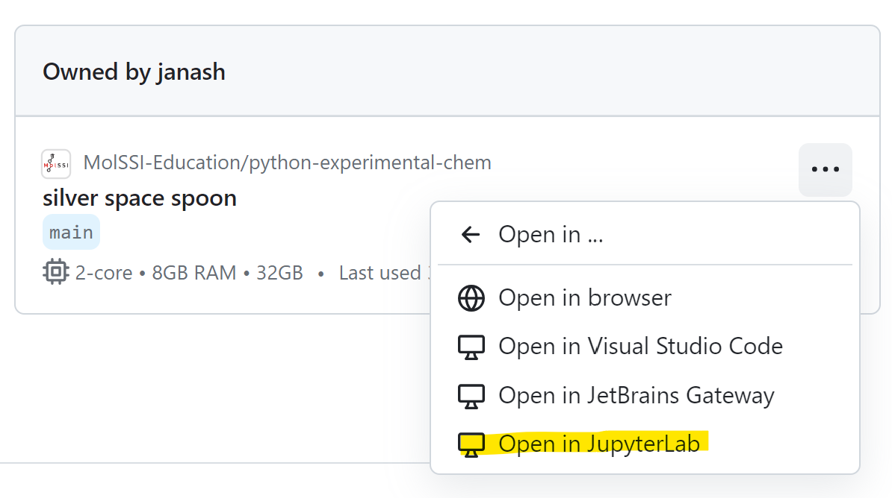

# Set Up

## Running Python in the Cloud

If you would just like to try out these notebooks to see if Python is right for you, we recommend running the notebooks in the cloud using GitHub Codespaces.

To use GitHub Codespaces, you will need a GitHub account. If you do not have one, you can create one for free at [github.com](https://github.com).

Next, click the following button to open the notebooks in GitHub Codespaces:

[](https://codespaces.new/MolSSI-Education/python-experimental-chem?editor=jupyter)

This will take a few minutes to start up. 
By default, the Codespace will open in an interface called VSCode. 
However, we recommend using the Jupyter Lab interface.
To use this interface, click [this link](https://github.com/codespaces) to see your Codespaces.
GitHub will have given your CodeSpace a random name.
Click the buttons with three dots to the right of your CodeSpace and select "Open with Jupyter Lab".



## Installing Python Locally

If you would like to install Python and run these notebooks on your own computer, we reccomend the following:


1. [Download and install miniconda](https://docs.conda.io/projects/miniconda/en/latest/miniconda-install.html) - Miniconda is a package manager that will allow you to install Python and other software needed for this workshop. If you already have conda installed, you can skip this step.

2. Install solver - We recommend changing a setting having to do with how packages are installed. After you have the conda package manager installed, open your terminal (if on Mac or Linux) or the Anaconda Prompt (if on Windows).

Note, if you have previously installed conda, you will first need to do the following in your terminal:

```bash
conda update -n base conda
```
Then, execute the following command

```bash
conda install -n base conda-libmamba-solver -c conda-forge
```

Then run this command

```bash
conda config --set solver libmamba
```

3. Clone or download the files for the workshop from the GitHub reposistory.

```bash
git clone https://github.com/MolSSI-Education/python-experimental-chem.git
```

4. Install the environment for the workshop
Once you've cloned the workshop materials, you can create an environment with all the necessary packages by navigating to the workshop directory and running the following command:

```bash
conda env create -f environment.yml
```

5. Test your installation

You can test your installation by activating the environment and opening the jupyter lab interface.

Type the following to activate your environment

```bash
conda activate sermacs-workshop
```

Type the following to open a Jupyter Lab interface:

```bash
jupyter lab
```
